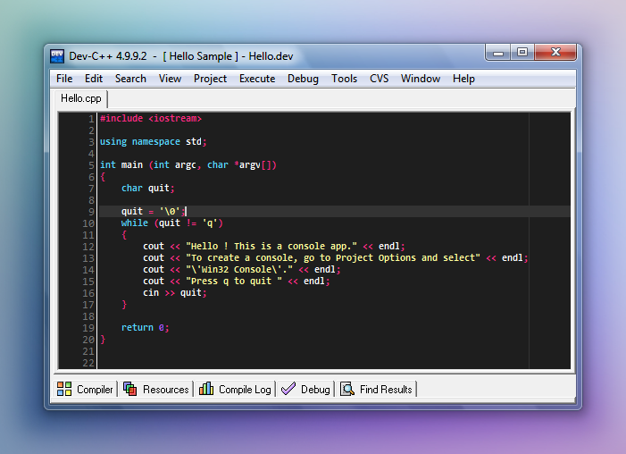

# Monokai theme for Dev-C++

TextMate theme [Monokai](http://www.monokai.nl/blog/2006/07/15/textmate-color-theme/) ported to Dev-C++.

Originally published [on deviantART](http://rbardini.deviantart.com/art/Monokai-theme-for-Dev-C-138240128) in 2009.

## Usage

1. Download [Monokai.syntax](https://raw.githubusercontent.com/rbardini/devcpp-monokai/master/Monokai.syntax) and move it to `C:\Users\<username>\AppData\Roaming\Dev-Cpp`.
2. Go to Dev-C++ _Tools › Editor Options › Syntax › Color Speed Settings_ and select _Monokai_.
3. Change _Right Margin_ and _Highlight current line_ colors to _Gray-80%_ in the _General_ tab. (optional)

## License

MIT
